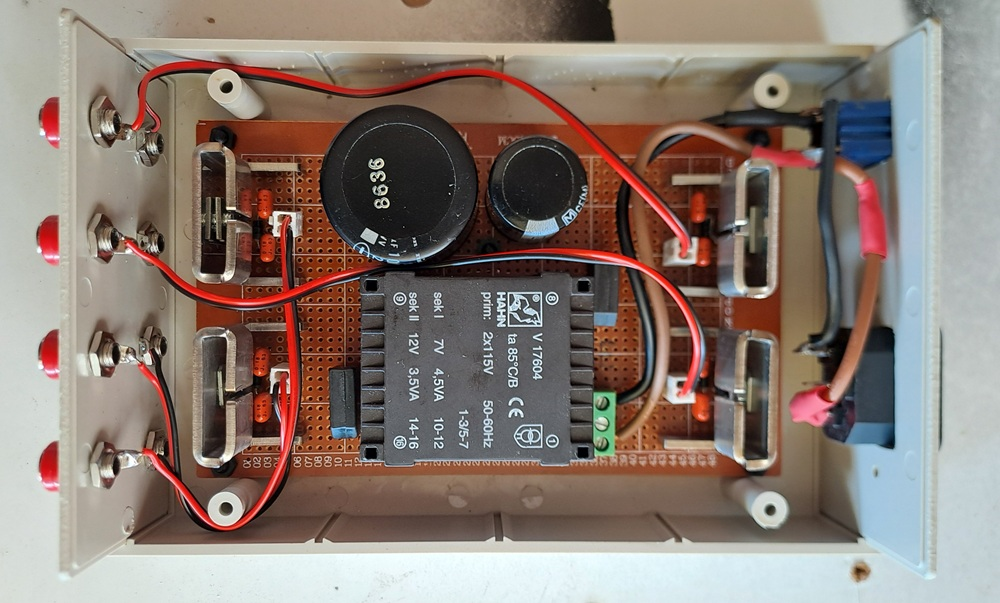
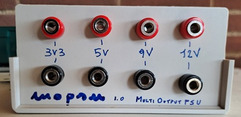
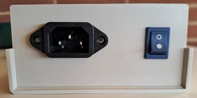
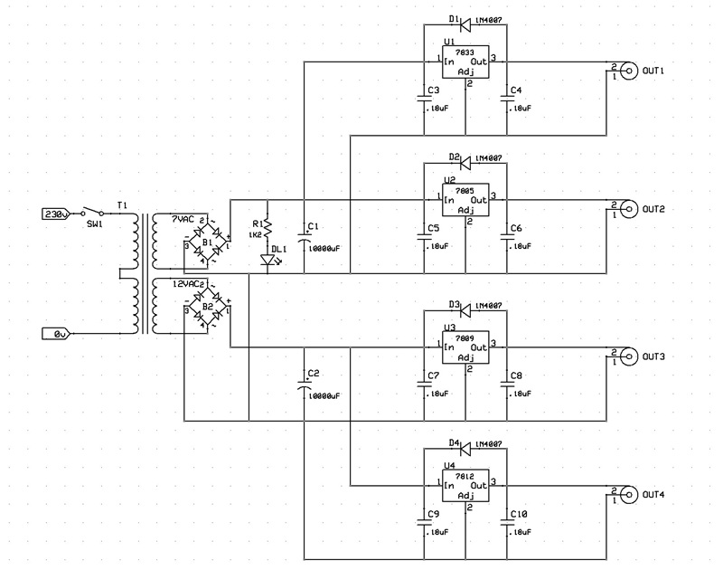
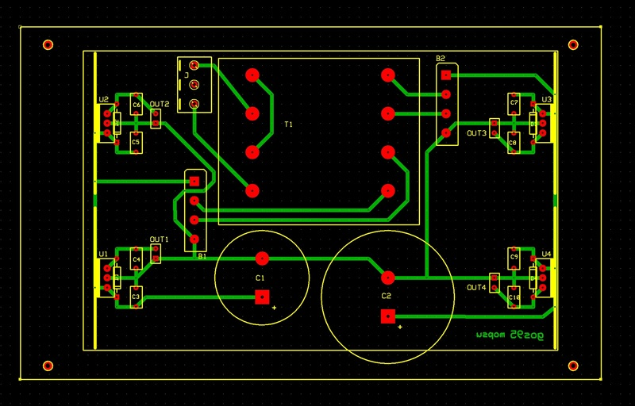

# Multi Out (Low)Power Supply Unit
A simple 4 output lines (3V3, 5V, 9V, 12V) linear power supply unit powered by the mains. 
The 3V3 and 5V output lines togheter carry a current up to 500mA.
The 9V and 12V output lines togheter carry a current up to 250mA.

## Requirements
- power source from mains
- 3V3-500mA regulated output line
- 5V-500mA regulated output line
- 9V-250mA regulated output line
- 12V-250mA regulated output line

## Design

#### Schematic

#### Circuit Analysis

## Implementation and Test

#### PCB Layout
The circuit was assembled on a custom PCB (protoboard).

#### Calibration Procedure

#### Test Log

## Conclusions
**Results**: 
  
**Suggestions**: 

**Evolutions**:

## About & License
**Author**: Alessandro Fraschetti (gom9000). 
**Technical Notes**: The hardware design was supported by **ExpressPCB** and the custom **[expresspcb-goslib](https://github.com/gom9000/expresspcb-goslib)** libraries. 
**License**: This experience is licensed under the [MIT License](LICENSE).
